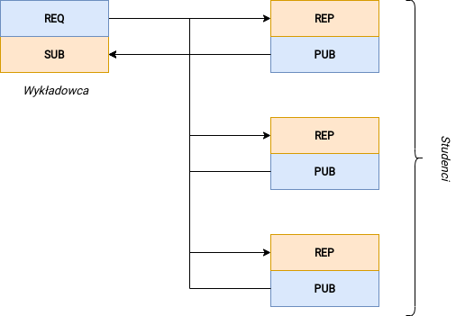
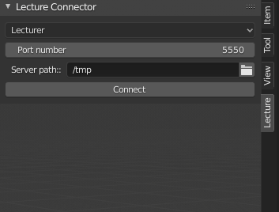
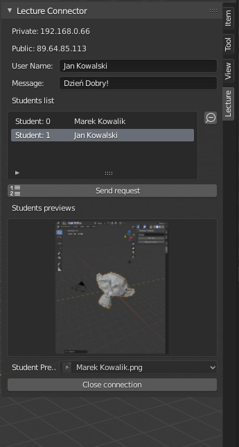
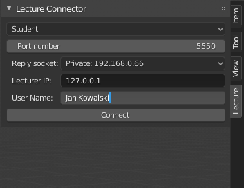
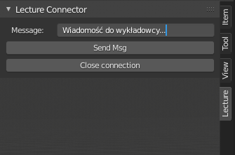

# Blender Lecture Connector
## About Project
The main goal of the project was to make communication between Lecturer and Students easier, in computer labs where Blender is used.

Add-on enables lecturer to see real-time progress of students, check details of student project by receive blend files. All files are stored in the path selected by Lecturer

Students can send short messages directly to Lecturer

## ZMQ Sockets
The main problem with sockets is that the server needs to listen all the time, for example in a while loop and that block UI for Lecturer. I was looking for some async solutions. One of them was to use Threading, but it could cause some memory leaks due to Blender's internal loop. Finally found perfect one ZeroMQ Sockets

## Network layer
I used Publisher-Subscriber pattern.
Lecturer have two types of sockets: 
    - REQ - for sending request to the student to receive blend file
    - SUB - for subscribing all students PUB sockets in purpose on tracking progress during the lab
  

## Interface
### Lecturer
Before connection is established             |  After connection is established
:-------------------------:|:-------------------------:
  |  

### Student
Before connection is established             |  After connection is established
:-------------------------:|:-------------------------:
  |  
